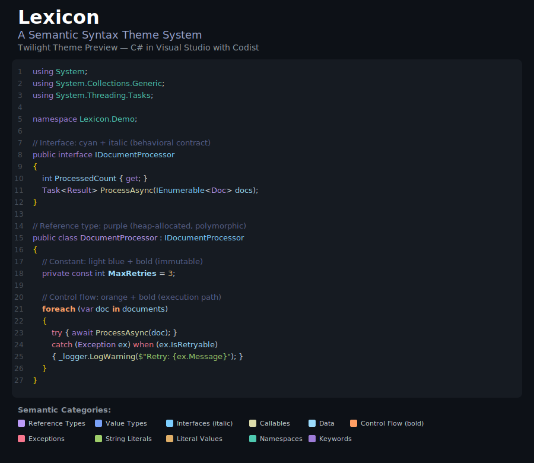
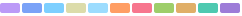

# Lexicon

**A Semantic Syntax Theme System** — *A color vocabulary for code.*



---

## Overview

Lexicon is a semantic syntax theme system for **C# in Visual Studio** using [**Codist**](https://github.com/wmjordan/Codist) ([GitHub](https://github.com/wmjordan/Codist) · [Marketplace](https://marketplace.visualstudio.com/items?itemName=wmj.Codist)). Every color carries meaning—once you learn the vocabulary, any C# codebase becomes easier to read.

> You already know the difference between a **class** and a **struct**. Between an `if` statement and a method call. Between a constant and a variable. Lexicon makes your editor know it too.

### Key Features

- 🎨 **11 semantic categories**: types, data, control flow, exceptions, literals, and more
- 🌈 **10 coordinated dark themes** sharing the same semantic vocabulary
- 🔍 **Designed for**: code review, debugging, and onboarding to unfamiliar codebases

---

## The Semantic Map

| Category | Semantic Role | Color |
|----------|--------------|-------|
| **Reference Types** | Heap-allocated, polymorphic types | 🟣 Purple |
| **Value Types** | Stack-allocated, copy-semantic types | 🔵 Blue |
| **Interfaces** | Behavioral contracts | 🩵 Cyan + *Italic* |
| **Callables** | Methods, constructors | 🟡 Yellow |
| **Data** | Fields, properties, parameters | 💠 Light Blue |
| **Control Flow** | `if`, `for`, `while`, `switch` | 🟠 Orange + **Bold** |
| **Exceptions** | `try`, `catch`, `throw` | 🔴 Coral |
| **String Literals** | `"text"`, `$"interpolated"` | 🟢 Green |
| **Literal Values** | `42`, `true`, `null`, enum members | 🟤 Amber |
| **Namespaces** | Organizational scope | 🩶 Teal |
| **Keywords** | `class`, `public`, `async` | 💜 Soft Purple |

---

## Theme Collection

| Theme | Palette | Vibe |
|-------|---------|------|
| **Twilight** ⭐ |  | Evening sky, "magic hour" coding |
| **Glacier** | | Arctic calm, reduced visual intensity |
| **Ember** | | Late-night warmth and creative energy |
| **Canopy** | | Forest canopy, organic feel |
| **Neon** | | Electric city, high-energy sessions |
| **Solstice** | | Solarized-inspired, calibrated precision |
| **Whisper** | | Soft, library-quiet coding |
| **Nocturne** | | Jewel tones on deep night |
| **Patina** | | Aged copper, archival feel |
| **Beacon** | | Accessibility-first, maximum contrast |

> **Recommended starting point**: Lexicon Twilight, with Beacon available as a high-contrast option.

---

## Installation

### 1. Import the Syntax Styles

1. Open Visual Studio
2. Go to **Tools → Options → Codist → Syntax Highlight**
3. Click **Load** and select the `.styles` file from your chosen theme folder (e.g., `themes/twilight/Lexicon-Twilight.styles`)

### 2. Register Custom Classification Types

The custom classification types (`Lexicon: Exception Keyword` and `Lexicon: Captured Variable`) must be registered in your **global Codist configuration folder**.

**Location of the global Codist config folder:**
```
%APPDATA%\Codist
```

Or typically:
```
C:\Users\<YourUsername>\AppData\Roaming\Codist
```

**Steps:**

1. Navigate to your Codist config folder (create it if it doesn't exist)
2. Copy `ClassificationTypes.json` from your theme folder to this location
   - If the file already exists, merge the `items` array contents
3. Restart Visual Studio for the changes to take effect

**Example merge:** If you already have classification types defined, add the Lexicon items to the existing array:

```json
{
  "items": [
    // ... your existing items ...
    {
      "name": "Lexicon: Exception Keyword",
      "foreground": "#f7768e",
      "bold": true
    },
    {
      "name": "Lexicon: Captured Variable",
      "background": "#30ffa657"
    }
  ]
}
```

### 3. Install Custom Classification Rules

Copy `Codist.ct.yaml` from your theme folder to `%APPDATA%\Codist\Codist.ct.yaml`

---

## License

See [LICENSE](LICENSE) for details.


