# Lexicon Twilight

> *The space between day and night, when colors are most alive.*

Twilight is the flagship theme—the reference implementation of the Lexicon semantic syntax system. Named for that liminal hour when the sun has set but darkness hasn't arrived, when the sky holds impossible colors: deep blues, soft purples, warm golds against the fading light. There's a reason photographers call it the "magic hour."

The palette balances cool and warm. Purple types against yellow methods. Cyan structure against orange decisions. The dark background (`#0d1117`) provides depth without harshness—like looking at the sky just after sunset. This is a theme for long sessions: high enough contrast to read easily, soft enough to work in for hours.

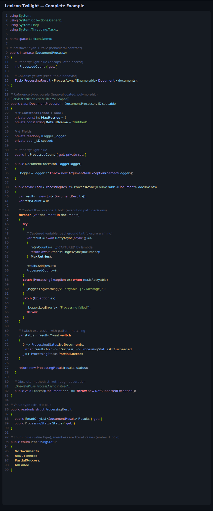

## Color Palette

| Semantic | Color | Swatch |
|----------|-------|--------|
| Reference Types | Soft Purple | 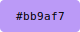 |
| Value Types | Sky Blue | 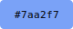 |
| Interfaces | Cyan | 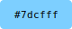 |
| Callables | Pale Yellow | 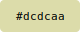 |
| Data | Light Blue | 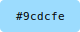 |
| Control Flow | Orange | 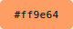 |
| Exceptions | Coral | 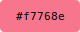 |
| String Literals | Green | 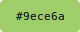 |
| Literal Values | Amber | 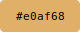 |
| Namespaces | Teal | 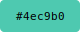 |
| Keywords | Violet | 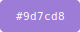 |

## Files

| File | Purpose |
|------|---------|
| `Lexicon-Twilight.styles` | Main syntax highlighting styles for Codist |
| `ClassificationTypes.json` | Custom classification type definitions |
| `Codist.ct.yaml` | Custom classification rules for semantic highlighting |

---

See the [main README](../../README.md#installation) for installation instructions.
